# SimuOS - PyQt6 Desktop OS Simulator

<p align="center">
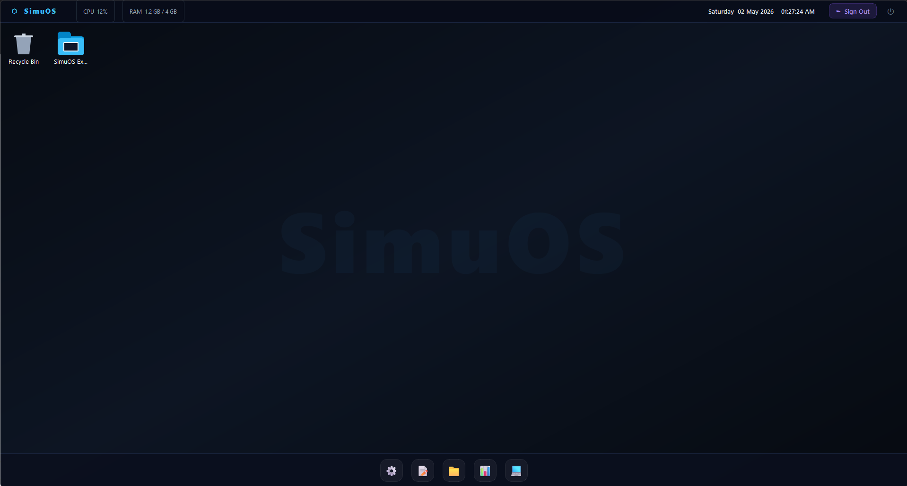
</p>

<p align="center">
<b>Modern desktop-like operating system simulation built with Python + PyQt6</b>
</p>

SimuOS demonstrates core OS ideas in an interactive GUI: boot flow, login, desktop apps, virtual file system, terminal commands, task monitoring, and session persistence.

## What I Made

- I built a desktop OS simulator using Python and PyQt6.
- I designed the full user flow: Boot -> Login -> Desktop.
- I implemented core apps: File Explorer, Terminal, Text Editor, Settings, and Task Manager.
- I added a virtual file system (VFS), command simulation, and session save/load support.
- I captured and organized screenshots for all main pages in the `screenshots/` folder.

    ## Overview

    ### What is inside?

    - 🚀 Boot Screen
    - 🔐 Login Screen
    - 🖥️ Desktop Environment
    - 📁 File Explorer
    - 💻 Terminal
    - ⚙️ Settings
    - 📝 Text Editor
    - 📊 Task Manager

    ## Features

    - ✨ Animated boot sequence
    - 🧑‍💻 Login system
    - 🗂️ Virtual File System (VFS)
    - 🔒 File metadata + permission simulation
    - ⌨️ Built-in terminal commands
    - 📝 Text editor integrated with VFS
    - 📈 Task Manager with live resource-style monitoring
    - 💾 Session save/load (`sessions/*.json`)
    - 🖨️ Disk / keyboard / printer event simulation

    ## Tech Stack

    - Python 3.10+ (recommended)
    - PyQt6 (GUI framework)

    ## Project Structure

    ```text
    simuos-pyqt6/
    ├─ main.py
    ├─ README.md
    ├─ screenshots/
    │  ├─ 01-boot.png
    │  ├─ 02-login.png
    │  ├─ 03-desktop.png
    │  ├─ 04-file-explorer.png
    │  ├─ 05-terminal.png
    │  ├─ 06-settings.png
    │  ├─ 07-text-editor.png
    │  ├─ 08-task-manager.png
    │  ├─ 09-account-settings.png
    │  ├─ 10-performance.png
    │  └─ 11-io-devices.png
    └─ sessions/   # auto-created after saving sessions
    ```

    ## Login

    - Username: `admin`
    - Password: `admin`

    ## Screenshots

    ### 🚀 Boot
    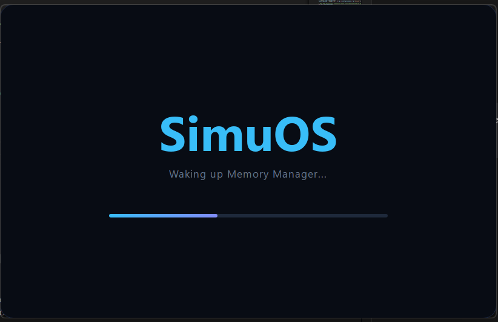

    ### 🔐 Login
    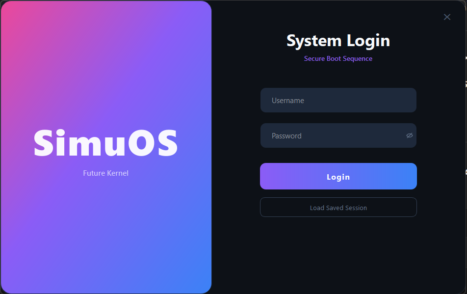

    ### 🖥️ Desktop
    

    ### 📁 File Explorer
    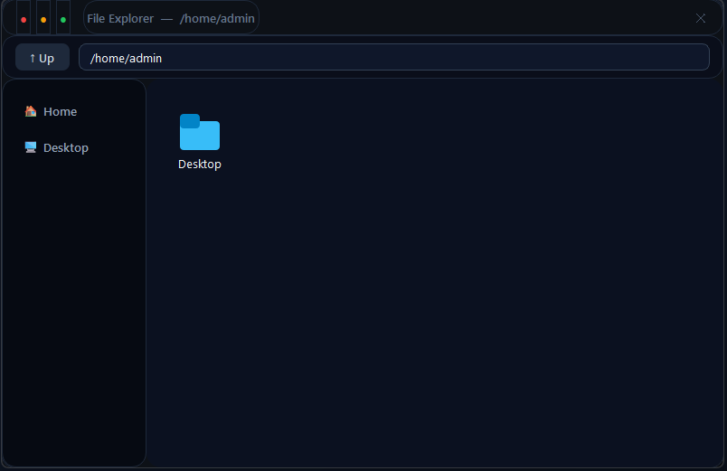

    ### 💻 Terminal
    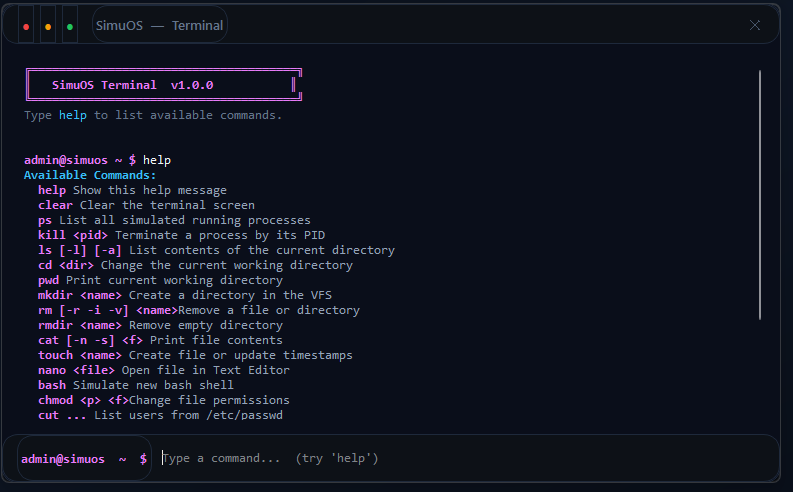

    ### ⚙️ Settings
    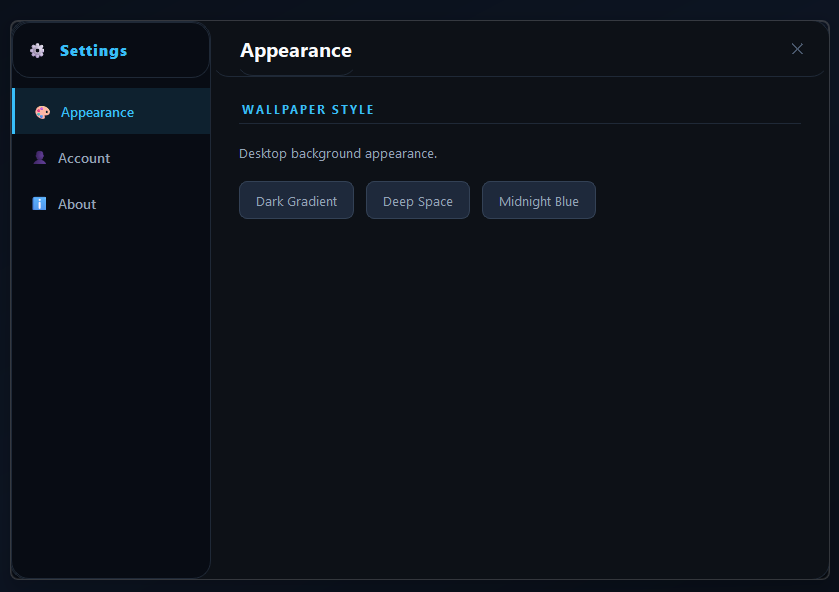
    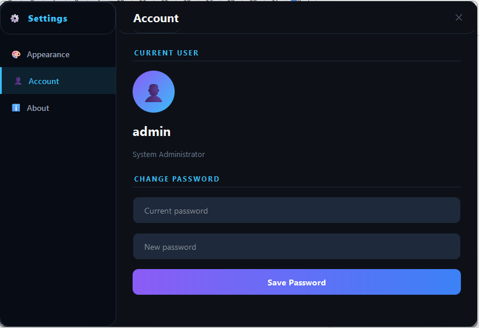
    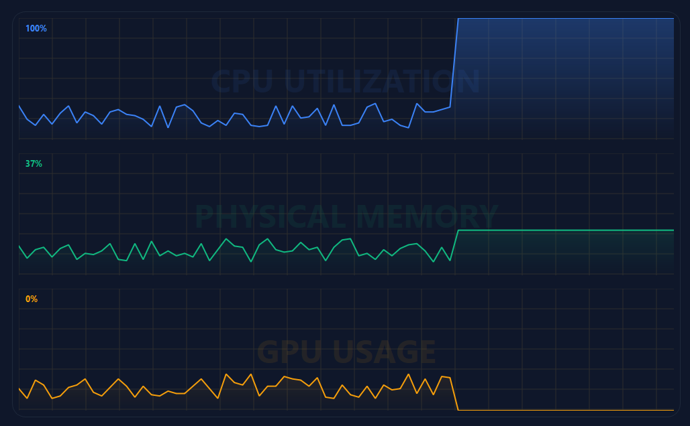
    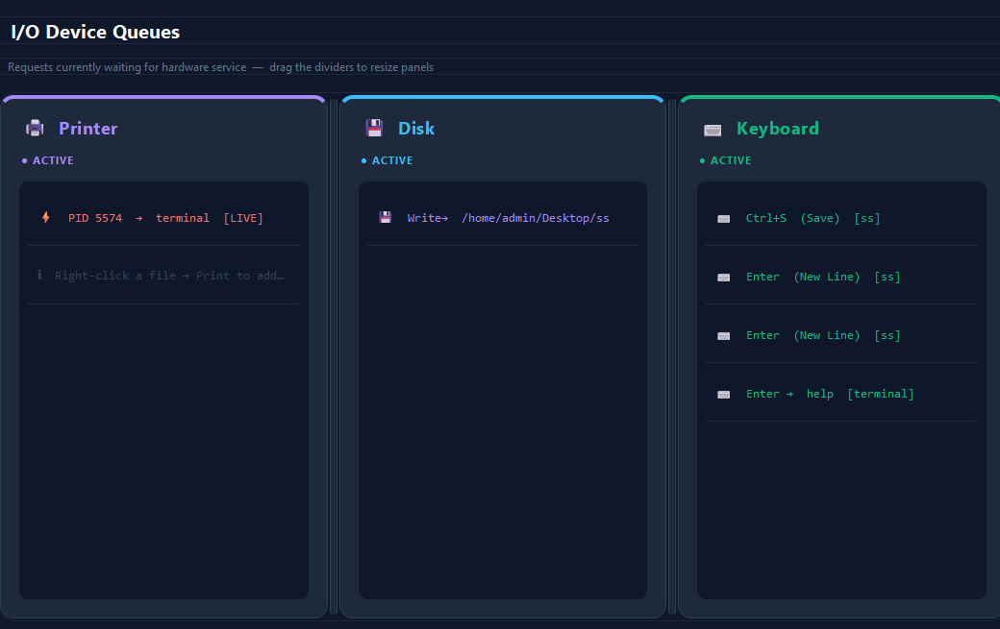

    ### 📝 Text Editor
    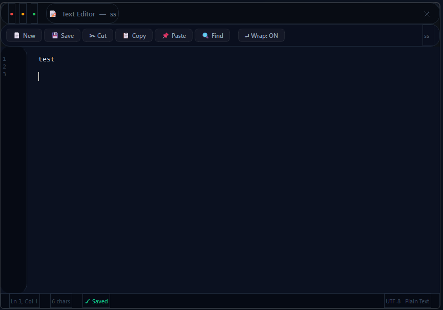

    ### 📊 Task Manager
    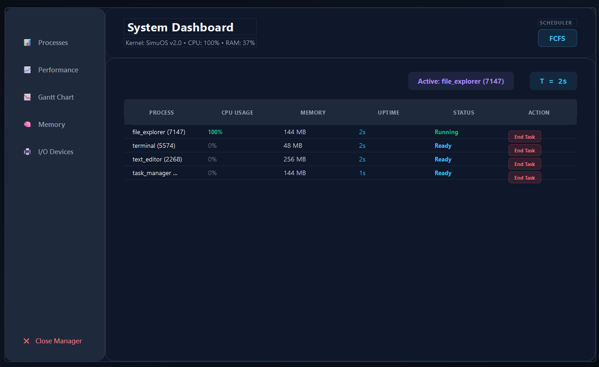


